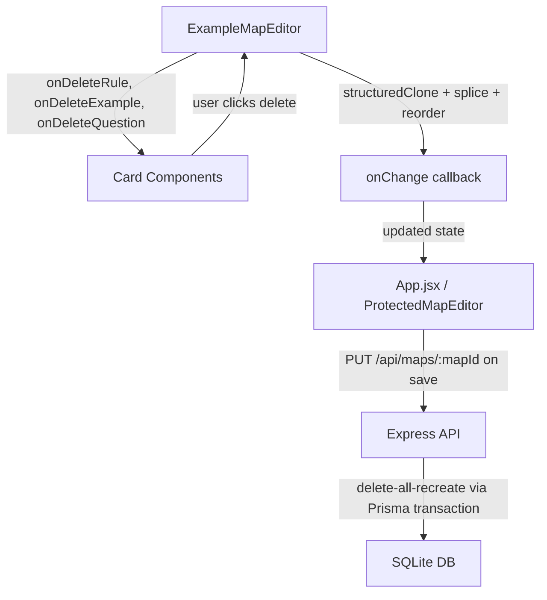

# Design Document: Delete Individual Items

## Overview

This feature adds the ability to delete individual rules, examples, and questions from the ExampleMapEditor. Currently, users can add and reorder these items but cannot remove them without deleting the entire map.

The design follows the existing patterns in ExampleMapEditor: delete handlers are defined alongside the existing `addRule`, `addExample`, and `addQuestion` functions, and delete callbacks are passed down to card components as props. Rule deletion requires a confirmation dialog (since it cascades to child examples), while example and question deletion are immediate.

No new API endpoints are needed. The existing `PUT /api/maps/:mapId` endpoint uses a delete-all-recreate strategy, so the frontend simply needs to send the updated state (with items removed) on save.

## Architecture

The feature is entirely frontend-driven with three layers:



**State flow**: Delete handlers in ExampleMapEditor clone the current data via `structuredClone`, remove the targeted item from the cloned array, reindex the `order` properties on remaining siblings, and call `onChange(clonedData)` — the same pattern used by `addRule`, `addExample`, `addQuestion`, and `handleDragEnd`.

**Confirmation flow**: Rule deletion uses a Radix AlertDialog component (new dependency: `@radix-ui/react-alert-dialog`) to warn the user that child examples will also be removed. Example and question deletions skip confirmation and act immediately.

## Components and Interfaces

### ExampleMapEditor (modified)

Three new handler functions, following the same clone-mutate-onChange pattern as the existing add handlers:

```javascript
// Delete a rule at index ri from story 0, with reordering
const deleteRule = (ri) => {
  const storyIndex = 0;
  const clonedData = structuredClone(data);
  clonedData.stories[storyIndex].rules.splice(ri, 1);
  clonedData.stories[storyIndex].rules.forEach((rule, index) => {
    rule.order = index;
  });
  onChange(clonedData);
};

// Delete an example at index ei from rule ri in story 0, with reordering
const deleteExample = (ri, ei) => {
  const storyIndex = 0;
  const clonedData = structuredClone(data);
  clonedData.stories[storyIndex].rules[ri].examples.splice(ei, 1);
  clonedData.stories[storyIndex].rules[ri].examples.forEach((ex, index) => {
    ex.order = index;
  });
  onChange(clonedData);
};

// Delete a question at index qi from story 0, with reordering
const deleteQuestion = (qi) => {
  const storyIndex = 0;
  const clonedData = structuredClone(data);
  clonedData.stories[storyIndex].questions.splice(qi, 1);
  clonedData.stories[storyIndex].questions.forEach((q, index) => {
    q.order = index;
  });
  onChange(clonedData);
};
```

These handlers are passed as props to the respective card components:
- `RuleCard` receives `onDeleteRule`
- `ExampleCard` receives `onDeleteExample`
- `QuestionCard` receives `onDeleteQuestion`

### State for confirmation dialog

ExampleMapEditor manages a piece of state to track which rule is pending deletion:

```javascript
const [pendingDeleteRuleIndex, setPendingDeleteRuleIndex] = useState(null);
```

When a rule's delete button is clicked, `setPendingDeleteRuleIndex(ri)` is called, which opens the AlertDialog. On confirm, `deleteRule(pendingDeleteRuleIndex)` is called and the state is reset. On cancel, the state is simply reset to `null`.

### RuleCard (modified)

New props: `onDeleteRule(ruleIndex)`

Adds a delete button (Trash2 icon from lucide-react, which is already a dependency) in the card header area. The button calls `onDeleteRule(ruleIndex)` which triggers the confirmation dialog in the parent.

```jsx
<Button
  variant="ghost"
  size="icon"
  onClick={() => onDeleteRule(ruleIndex)}
  aria-label={`Delete rule: ${ruleData?.text || 'Untitled rule'}`}
  className="h-6 w-6 text-red-500 hover:text-red-700 hover:bg-red-50"
>
  <Trash2 className="h-4 w-4" />
</Button>
```

### ExampleCard (modified)

New props: `onDeleteExample(ruleIndex, exampleIndex)`

Adds a delete button that calls `onDeleteExample(ruleIndex, exampleIndex)` directly — no confirmation dialog.

```jsx
<Button
  variant="ghost"
  size="icon"
  onClick={() => onDeleteExample(ruleIndex, exampleIndex)}
  aria-label={`Delete example: ${exampleData?.text || 'Untitled example'}`}
  className="h-6 w-6 text-red-500 hover:text-red-700 hover:bg-red-50"
>
  <Trash2 className="h-4 w-4" />
</Button>
```

### QuestionCard (modified)

New props: `onDeleteQuestion(questionIndex)`

Adds a delete button that calls `onDeleteQuestion(questionIndex)` directly — no confirmation dialog.

```jsx
<Button
  variant="ghost"
  size="icon"
  onClick={() => onDeleteQuestion(questionIndex)}
  aria-label={`Delete question: ${questionData?.text || 'Untitled question'}`}
  className="h-6 w-6 text-red-500 hover:text-red-700 hover:bg-red-50"
>
  <Trash2 className="h-4 w-4" />
</Button>
```

### Confirmation Dialog Component

A new `ConfirmDeleteRuleDialog` component using `@radix-ui/react-alert-dialog`. This is preferred over `@radix-ui/react-dialog` because AlertDialog is specifically designed for destructive confirmations — it requires explicit user action and traps focus appropriately.

```jsx
import * as AlertDialog from '@radix-ui/react-alert-dialog';

function ConfirmDeleteRuleDialog({ open, onConfirm, onCancel, ruleText }) {
  return (
    <AlertDialog.Root open={open} onOpenChange={(isOpen) => { if (!isOpen) onCancel(); }}>
      <AlertDialog.Portal>
        <AlertDialog.Overlay className="fixed inset-0 bg-black/50" />
        <AlertDialog.Content className="fixed top-1/2 left-1/2 -translate-x-1/2 -translate-y-1/2 bg-white rounded-lg p-6 shadow-xl max-w-md w-full">
          <AlertDialog.Title className="text-lg font-bold">Delete Rule</AlertDialog.Title>
          <AlertDialog.Description className="mt-2 text-sm text-gray-600">
            Are you sure you want to delete the rule "{ruleText}"? This will also delete all examples belonging to this rule. This action cannot be undone.
          </AlertDialog.Description>
          <div className="mt-4 flex justify-end gap-3">
            <AlertDialog.Cancel asChild>
              <Button variant="outline" onClick={onCancel}>Cancel</Button>
            </AlertDialog.Cancel>
            <AlertDialog.Action asChild>
              <Button variant="destructive" onClick={onConfirm}>Delete</Button>
            </AlertDialog.Action>
          </div>
        </AlertDialog.Content>
      </AlertDialog.Portal>
    </AlertDialog.Root>
  );
}
```

**Design decision**: Using `@radix-ui/react-alert-dialog` instead of the already-installed `@radix-ui/react-dialog` because AlertDialog enforces that the user must explicitly confirm or cancel — it cannot be dismissed by clicking the overlay or pressing Escape without triggering the cancel action. This is the correct UX pattern for destructive operations.

### Reordering After Deletion

Each delete handler reindexes the `order` property on remaining siblings using a simple `forEach` with the array index. This is the same approach used in `handleDragEnd` for reordering after drag-and-drop:

```javascript
// After splice, reindex:
remainingItems.forEach((item, index) => {
  item.order = index;
});
```

This ensures order values are always sequential starting from 0, with no gaps.

### Persistence

No changes to the API or Prisma schema are needed. The existing save flow works as follows:

1. Frontend sends `PUT /api/maps/:mapId` with the full map state (minus deleted items)
2. `updateMap` controller runs a Prisma transaction that:
   - Deletes all existing stories for the map (`tx.story.deleteMany`)
   - Recreates stories, rules, examples, and questions from the request body
3. Prisma's `onDelete: Cascade` on Story → Rule → Example and Story → Question handles cleanup

Since deleted items are simply absent from the request body, they are not recreated. The delete-all-recreate strategy means no special handling is needed for deletions.

## Data Models

No changes to the Prisma schema or database models. The existing models already support the delete flow:

- `Story` has `onDelete: Cascade` from `ExampleMap`
- `Rule` has `onDelete: Cascade` from `Story`
- `Example` has `onDelete: Cascade` from `Rule`
- `Question` has `onDelete: Cascade` from `Story`

The frontend state shape remains unchanged. The `data` object passed to ExampleMapEditor has this structure:

```typescript
interface MapData {
  id?: string;
  title: string;
  description: string;
  stories: Array<{
    text: string;
    order: number;
    rules: Array<{
      text: string;
      order: number;
      examples: Array<{
        text: string;
        order: number;
      }>;
    }>;
    questions: Array<{
      text: string;
      order: number;
    }>;
  }>;
}
```

Delete operations modify this structure in-place (on a clone) by splicing items from arrays and reindexing `order` values.

## Correctness Properties

*A property is a characteristic or behavior that should hold true across all valid executions of a system — essentially, a formal statement about what the system should do. Properties serve as the bridge between human-readable specifications and machine-verifiable correctness guarantees.*

### Property 1: Rule deletion removes the rule and all its child examples

*For any* valid map state containing at least one rule, and *for any* valid rule index within that state, calling `deleteRule(ruleIndex)` SHALL produce a new state where:
- The targeted rule no longer exists in the rules array
- All examples that belonged to the targeted rule are absent from the state
- The total number of rules is reduced by exactly one

**Validates: Requirements 2.3**

### Property 2: Cancelling rule deletion is a no-op

*For any* valid map state and *for any* valid rule index, initiating a rule deletion and then cancelling SHALL produce a state that is deeply equal to the original state.

**Validates: Requirements 2.4**

### Property 3: Example deletion removes exactly the targeted example

*For any* valid map state containing at least one example in any rule, and *for any* valid (ruleIndex, exampleIndex) pair, calling `deleteExample(ruleIndex, exampleIndex)` SHALL produce a new state where:
- The targeted example is absent from the parent rule's examples array
- All sibling examples (same rule, different index) remain present with their original text
- Examples in other rules are completely unchanged
- The parent rule's example count is reduced by exactly one

**Validates: Requirements 3.1, 3.2**

### Property 4: Question deletion removes exactly the targeted question

*For any* valid map state containing at least one question, and *for any* valid question index, calling `deleteQuestion(questionIndex)` SHALL produce a new state where:
- The targeted question is absent from the story's questions array
- All sibling questions remain present with their original text
- The question count is reduced by exactly one

**Validates: Requirements 4.1, 4.2**

### Property 5: Remaining items have sequential order after deletion

*For any* valid map state and *for any* deletion operation (rule, example, or question), the remaining items of that type SHALL have `order` values that form a contiguous sequence starting from 0 with no gaps. Formally: for an array of N remaining items, item at index i has `order === i` for all 0 ≤ i < N.

**Validates: Requirements 5.1, 5.2, 5.3**

## Error Handling

### Frontend

| Scenario | Handling |
|---|---|
| Delete button clicked on a rule with no examples | Confirmation dialog still appears (warns "0 examples will be deleted") — consistent UX |
| `structuredClone` fails (extremely unlikely) | JavaScript runtime error; no special handling needed |
| Invalid index passed to delete handler | Guard clause: check array bounds before splicing. If index is out of range, return without modifying state |
| State is null/undefined when delete is called | Guard clause: early return if `!data?.stories?.[0]` (same pattern as existing `addRule`) |

### Backend

No new error handling needed. The existing `updateMap` controller already handles:
- Missing authentication (401 via `protect` middleware)
- Map not found (404)
- Map owned by different user (403)
- Invalid request body (400)

## Testing Strategy

### BDD / Gherkin Tests

The primary test suite is the Gherkin feature file at `features/delete-individual-items.feature` with 18 scenarios. Step definitions will be implemented in `features/steps/delete-individual-items.steps.js`.

**Step definition structure:**

The step definitions will use `@testing-library/react` to render the `ExampleMapEditor` component with controlled state, simulating user interactions (clicking delete buttons, confirming/cancelling dialogs) and asserting on the resulting DOM and state.

Key step definition categories:
1. **Background steps**: Set up a map with known structure, render the editor
2. **Action steps**: Click delete buttons, confirm/cancel dialogs, save, reload
3. **Assertion steps**: Check item presence/absence, count items, verify order values, check button visibility

**Dependencies to add for testing:**
- `@cucumber/cucumber` — BDD test runner
- `@testing-library/react` — React component testing
- `@testing-library/jest-dom` — DOM assertion matchers
- `jsdom` — DOM environment for Node.js tests

### Property-Based Tests

Property-based tests will use **fast-check** to validate the five correctness properties defined above. Each property test generates random map states and random deletion targets, then verifies the invariants hold.

**Configuration:**
- Library: `fast-check`
- Minimum iterations: 100 per property
- Test file: `src/__tests__/delete-handlers.property.test.js`

**Generator strategy:**
A custom `arbitraryMapData` generator produces random map states with:
- 1–5 rules per story, each with 0–4 examples
- 0–5 questions per story
- Random text strings for all items
- Sequential order values

Each property test picks a random valid index from the generated state and applies the corresponding delete handler.

**Tag format for each test:**
```
Feature: delete-individual-items, Property {N}: {property text}
```

### Unit Tests (Example-Based)

Example-based unit tests cover:
- Delete button rendering on each card type (Requirements 1.1–1.3)
- Confirmation dialog appears on rule delete click (Requirement 2.1)
- Dialog warning text mentions child examples (Requirement 2.2)
- Empty state after last item deletion — "Add Rule", "+ Example", "Add Question" buttons remain visible (Requirements 6.1–6.3)

### Integration Tests

Integration tests cover the persistence round-trip:
- Delete items → save → reload → verify deleted items are absent (Requirements 7.1, 7.2)
- Auth/ownership checks on save after deletion (Requirements 8.1, 8.2)

These use the existing Express API with a test database.
